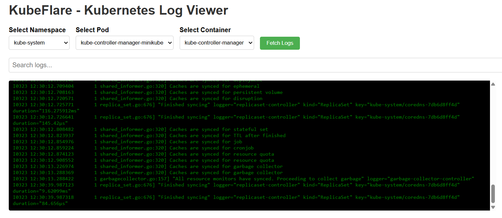

# KubeFlare - Kubernetes Log Viewer

KubeFlare is a React-based web application that provides an intuitive interface for viewing and searching Kubernetes logs across multiple namespaces, pods, and containers.

## Features

- Select and view logs from different namespaces, pods, and containers
- Real-time log streaming
- Search functionality to find specific log entries
- Highlighted search results for better visibility

## Backend Requirements

This frontend application requires the KubeFlare backend service to be running. You can find the backend repository at:
- [KubeFlare Backend](https://github.com/Amrish-Sharma/kubeflare)

Make sure to set up and run the backend service before starting the frontend application.


## Getting Started

### Prerequisites

- Node.js (version 14 or later)
- npm (version 6 or later)

### Installation

1. Clone the repository:

```bash
git clone https://github.com/Amrish-Sharma/kubeflare-log-viewer.git
cd kubeflare-log-viewer
```

2. Install dependencies:

```bash
npm install
```

3. Start the development server:

```bash
npm start
```

The application will be available at `http://localhost:3000`.

## Usage

1. Select a namespace from the dropdown menu
2. Choose a pod from the available options
3. Select a container within the chosen pod
4. Click "Fetch Logs" to retrieve and display the logs
5. Use the search bar to filter log entries

## Building for Production

To create a production build, run:

```bash
npm run build
```

This will generate optimized static files in the `build` directory.

## Screen



## Docker Support

A Dockerfile is provided to containerize the application. To build and run the Docker image:

```bash
docker build -t kubeflare-frontend .
docker run -p 80:80 kubeflare-frontend
```

## Contributing

Contributions are welcome! Please feel free to submit a Pull Request.

## License

This project is licensed under the MIT License.